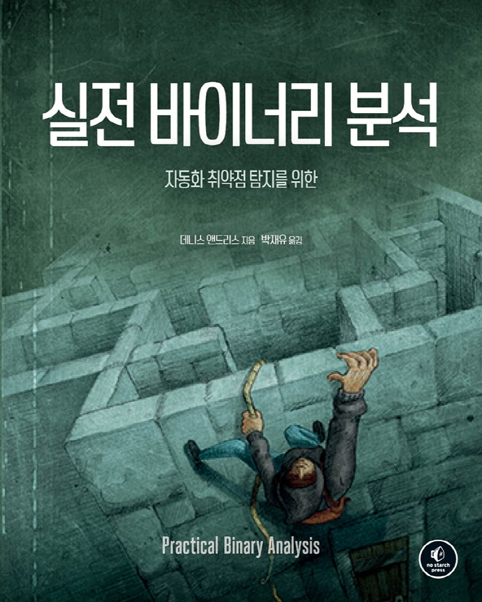

# 실전 바이너리 분석



이 저장소에는 [(자동화 취약점 탐지를 위한) 실전 바이너리 분석](http://www.acornpub.co.kr/book/binary-analysis) 한국어판 도서의 예제 소스코드를 포함하고 있습니다.


## 이 책에서 다루는 내용
- ELF 및 PE 바이너리 분석, libbfd를 이용한 바이너리 로더 구현
- 헥스 값 수정 및 바이러스 코드 삽입을 통한 ELF 바이너리 개조 기법
- Capstone을 사용한 자체 개발 디스어셈블 도구 구현
- 안티 분석 기법을 우회하기 위한 바이너리 계측 방법론
- 제어 흐름 탈취 및 데이터 유출 공격을 막기 위한 오염 분석 적용
- 기호 실행을 통한 자동화 취약점 악용 도구 개발

## 소스코드 구성
각 소스코드는 책의 각 장별로 폴더로 구분되어 있습니다. 

```
$ git clone https://github.com/cpuu/PracticalBinaryAnalysis.git
$ cd ./PracticalBinaryAnalysis/code/
$ ls
chapter1 chapter2 chapter3 chapter4 chapter5 chapter6 chapter7
chapter8 chapter9 chapter10 chapter11 chapter12 chapter13 inc
```

## 원서
### 제목
[Practical Binary Analysis: Build Your Own Linux Tools for Binary Instrumentation, Analysis, and Disassembly (ISBN 9781593279127)](https://practicalbinaryanalysis.com/)
### 저자
[Dennis Andriesse](https://mistakenot.net/)


## 문의
도서를 구입해주셔서 감사합니다. 문의사항이 있으시거나 내용 중 도서 오류 또는 오탈자 제보가 필요하신 경우 cpuu@icloud.com 또는 [출판사 홈페이지](http://acornpub.co.kr/contact/errata)를 통해 알려주시기 부탁드립니다.
